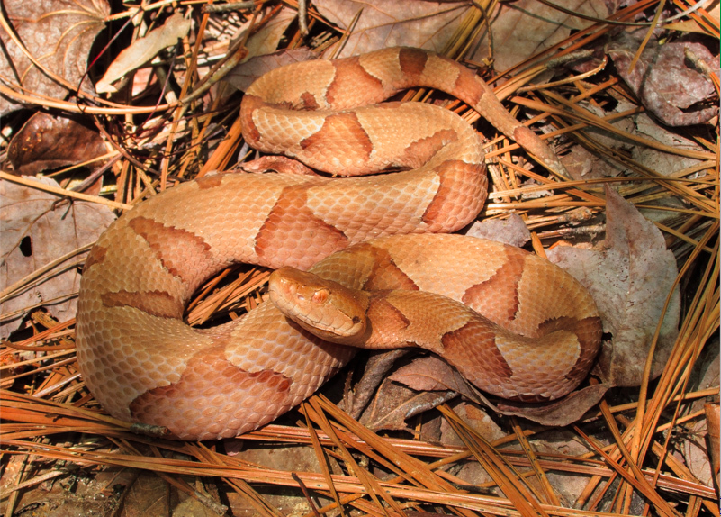

<body style="background-color:#DDA15E;">
```{=html}
<style type="text/css">

h1.title {
  font-size: 40px;
  font-family: "Times New Roman", Times, serif;
  color: Black;
  text-align: center;
}

h4.author { /* Header 4 - and the author and data headers use this too  */
  font-size: 25px;
  font-family: "Times New Roman", Times, serif;
  font-weight: bold;
  color: #D02349;
  text-align: center;
}

body {
  font-family: Helvetica;
  font-size: 12pt;
}

.zoom {
  transform-origin: 40% 50% 0;
  transition: transform .2s;
  margin: 0 auto;
}
.zoom img{
	width:auto;
	height:auto;	
}
.zoom:hover {
  transform: scale(2);
}

th, td {padding: 5px;}

</style>
```


```{r setup, include=FALSE, message=FALSE, warning=FALSE}
packages<-c("adehabitatHR","data.table","ggfortify","grid","move","moveVis","OpenStreetMap","pbapply","plotly","rgdal","sp","tidyverse","viridis", "rgeos","dplyr")

sapply(packages, library, character.only=T)
```

# Home Range Analysis 

The data presented here was sampled from movebank.org and was originally published here: 

**Carrasco-Harris MF, Bowman D, Reichling S, Cole JA. 2020. Spatial ecology of copperhead snakes (Agkistrodon contortrix) in response to urban park trails. J Urban Ecol. 6(1):juaa007. https://doi.org/10.1093/jue/juaa007** 

In their study, the authors measured the spatial activity of copperheads (*Agkistrodon contortrix*) around pedestrian trails in an urban forest (Overton Park, Memphis, TN) using radio telemetry. They found that sex and season, not distance to the nearest trail, affected the distance that snakes moved and concluded that copperheads may be tolerant of low-level human disturbances. 



<br>

# Bring in data 

<details><summary><big>Import Dataset with ```read.csv```</big></summary>
```{r read in data}
snake.data <- read.csv("data/snakes.csv")
snake <- snake.data %>%
    filter(individual.local.identifier == c("ID_4241","ID_4270","ID_7270","ID_4266"))
```

<br> 

**I decided to subset for just 4 individuals that I thought gave a good representation of the data. These snakes each primarily resided in different sections of the park and displayed variation in the sizes of their respective home ranges.** 

<br>

</details>
```{r}
head(snake)
```

<br>

## Looking for Outliers 

<br>

**The points appear to be have a similar spread for each individual without any clear outliers among them (at least to my eyes).**

<br>

```{r qaqc plot, echo=TRUE, fig.height=6, fig.width=8, message=FALSE, warning=FALSE}
qaqc_plot <- ggplot() + geom_point(data=snake, 
                                   aes(utm.easting,utm.northing,
                                       color=individual.local.identifier)) +
                        labs(x="Easting", y="Northing") +
                        guides(color=guide_legend("Identifier"))

ggplotly(qaqc_plot)
```

```{r split data, echo=TRUE, message=FALSE, warning=FALSE}
lapply(split(snake, snake$individual.local.identifier), 
       function(x)write.csv(x, file = paste(x$individual.local.identifier[1],".csv", sep = ""), row.names = FALSE))
```

```{r make list of individual files, echo=TRUE, message=FALSE, warning=FALSE}
files <- list.files(path = ".", pattern = "[ID_]+[3413-7274]+", full.names = TRUE)
```

<br>

# Analysis 

```{r first analysis, echo=TRUE, message=FALSE, warning=FALSE}
utm_points <- cbind(snake$utm.easting, snake$utm.northing)
utm_locations <- SpatialPoints(utm_points, 
                 proj4string=CRS("+proj=utm +zone=16 +datum=WGS84"))
proj_lat.lon <- as.data.frame(spTransform(
                utm_locations, CRS("+proj=longlat +datum=WGS84")))
colnames(proj_lat.lon) <- c("x","y")
raster2 <- openmap(c(max(proj_lat.lon$y)+0.003, min(proj_lat.lon$x)-0.003), 
                  c(min(proj_lat.lon$y)-0.003, max(proj_lat.lon$x)+0.003), 
                  type = "bing")
raster <- openmap(c(max(proj_lat.lon$y)+0.01, min(proj_lat.lon$x)-0.01), 
                  c(min(proj_lat.lon$y)-0.01, max(proj_lat.lon$x)+0.01), 
                  type = "bing")
raster_utm <- openproj(raster, 
              projection = "+proj=utm +zone=16 +datum=WGS84 +units=m +no_defs")
raster2_utm <- openproj(raster2, 
              projection = "+proj=utm +zone=16 +datum=WGS84 +units=m +no_defs")
```

<br> 

**I decided to make a second raster that still takes into account the location of the points when choosing the maximum and minimum coordinates of the resulting map, but with a smaller window to get us slightly more zoom over our park (which represents such a small area).** 

**Here's the map made with the raster inputs from Dr. Gentry's code:**

<br>

```{r raster map, message=FALSE, warning=FALSE}
autoplot.OpenStreetMap(raster_utm, expand = TRUE) + theme_bw() +
  theme(legend.position="right") +
  theme(panel.border = element_rect(colour = "black", fill=NA, size=1)) +
  geom_point(data=snake, aes(utm.easting,utm.northing,
             color=individual.local.identifier), size = 1, alpha = 0.8) +
  theme(axis.title = element_text(face="bold")) + labs(x="Easting",
        y="Northing") + guides(color=guide_legend("Identifier"))
```

<br> 

**And with a constrained window:** 

<br>

```{r raster2 map, message=FALSE, warning=FALSE}
autoplot.OpenStreetMap(raster2_utm, expand = TRUE) + theme_bw() +
  theme(legend.position="right") +
  theme(panel.border = element_rect(colour = "black", fill=NA, size=1)) +
  geom_point(data=snake, aes(utm.easting,utm.northing,
             color=individual.local.identifier), size = 1, alpha = 0.8) +
  theme(axis.title = element_text(face="bold")) + labs(x="Easting",
        y="Northing") + guides(color=guide_legend("Identifier"))
```

<br>

# Home Range Analysis 

<br>

## Minimum Convex Polygon 

<br> 

**For some reason I was having an issue with the permit status (?) using the pbapply package. For whatever reason and completely mysteriously to me, the first three lines of code in this chunk fixed the issue for me** 

<br>

```{r minimum convex polygons,fig.height=8, fig.width=10, message=FALSE, warning=FALSE}
library(maptools)
if (!require(gpclib)) install.packages("gpclib", type="source")
gpclibPermit() #This resolved the following error message from pbapply: "Error: isTRUE(gpclibPermitStatus()) is not TRUE"

mcp_raster <- function(filename){
  data <- read.csv(file = filename)
  x <- as.data.frame(data$utm.easting)
  y <- as.data.frame(data$utm.northing)
  xy <- c(x,y)
  data.proj <- SpatialPointsDataFrame(xy,data, proj4string = CRS("+proj=utm +zone=16 +datum=WGS84 +units=m +no_defs"))
  xy <- SpatialPoints(data.proj@coords)
  mcp.out <- mcp(xy, percent=100, unout="ha")
  mcp.points <- cbind((data.frame(xy)),data$individual.local.identifier)
  colnames(mcp.points) <- c("x","y", "identifier")
  mcp.poly <- fortify(mcp.out, region = "id")
  units <- grid.text(paste(round(mcp.out@data$area,2),"ha"), x=0.85,  y=0.95,
                     gp=gpar(fontface=4, col="white", cex=0.9), draw = FALSE)
  mcp.plot <- autoplot.OpenStreetMap(raster2_utm, expand = TRUE) + theme_bw() + theme(legend.position="none") +
    theme(panel.border = element_rect(colour = "black", fill=NA, size=1)) +
    geom_polygon(data=mcp.poly, aes(x=mcp.poly$long, y=mcp.poly$lat), alpha=0.5, fill = "red") +
    geom_point(data=mcp.points, aes(x=x, y=y)) + 
    labs(x="Easting (m)", y="Northing (m)", title=mcp.points$identifier) +
    theme(legend.position="none", plot.title = element_text(face = "bold", hjust = 0.5)) + 
    annotation_custom(units)
  mcp.plot
}

pblapply(files, mcp_raster)
```

<br>

## Kernel-Density Estimation 

```{r kernel density, fig.height=8, fig.width=10, message=FALSE, warning=FALSE}
kde_raster <- function(filename){
  data <- read.csv(file = filename)
  x <- as.data.frame(data$utm.easting)
  y <- as.data.frame(data$utm.northing)
  xy <- c(x,y)
  data.proj <- SpatialPointsDataFrame(xy,data, proj4string = CRS("+proj=utm +zone=16 +datum=WGS84 +units=m +no_defs"))
  xy <- SpatialPoints(data.proj@coords)
  kde<-kernelUD(xy, h="href", kern="bivnorm", grid=100)
  ver <- getverticeshr(kde, 95)
  kde.points <- cbind((data.frame(data.proj@coords)),data$individual.local.identifier)
  colnames(kde.points) <- c("x","y","identifier")
  kde.poly <- fortify(ver, region = "id")
  units <- grid.text(paste(round(ver$area,2)," ha"), x=0.85,  y=0.95,
                     gp=gpar(fontface=4, col="white", cex=0.9), draw = FALSE)
  kde.plot <- autoplot.OpenStreetMap(raster2_utm, expand = TRUE) + theme_bw() + theme(legend.position="none") +
    theme(panel.border = element_rect(colour = "black", fill=NA, size=1)) +
    geom_polygon(data=kde.poly, aes(x=kde.poly$long, y=kde.poly$lat), alpha = 0.5, fill = "red") +
    geom_point(data=kde.points, aes(x=x, y=y)) +
    labs(x="Easting (m)", y="Northing (m)", title=kde.points$identifier) +
    theme(legend.position="none", plot.title = element_text(face = "bold", hjust = 0.5)) + 
    annotation_custom(units)
  kde.plot
}

pblapply(files, kde_raster)
```

<br>

## Brownian Bridge Movement

```{r Brownian Bridge Movement, fig.height=8, fig.width=10, message=FALSE, warning=FALSE}
snake_4241 <- read.csv("ID_4241.csv")
date <- as.POSIXct(strptime(as.character(snake_4241$timestamp),"%Y-%m-%d %H:%M:%S", tz="Asia/Bangkok"))
snake_4241$date <- date
snake_4241.reloc <- cbind.data.frame(snake_4241$utm.easting, snake_4241$utm.northing,
                                as.vector(snake_4241$individual.local.identifier),
                                as.POSIXct(date))
colnames(snake_4241.reloc) <- c("x","y","id","date")
trajectory <- as.ltraj(snake_4241.reloc, date=date, id="snake_4241")
sig1 <- liker(trajectory, sig2 = 58, rangesig1 = c(0, 5), plotit = FALSE)
snake_4241.traj <- kernelbb(trajectory, sig1 = .7908, sig2 = 58, grid = 100)
bb_ver <- getverticeshr(snake_4241.traj, 58)
bb_poly <- fortify(bb_ver, region = "id", 
                   proj4string = CRS("+proj=utm +zone=16+
                                     datum=WGS84 +units=m +no_defs"))
colnames(bb_poly) <- c("x","y","order","hole","piece","id","group")
bb_image <- crop(snake_4241.traj, bb_ver, 
                 proj4string = CRS("+proj=utm +zone=16 +
                                   datum=WGS84 +units=m +no_defs"))
bb_units <- grid.text(paste(round(bb_ver$area,2)," ha"), x=0.85,  y=0.95,
                   gp=gpar(fontface=4, col="white", cex=0.9), draw = FALSE)
bb.plot <- autoplot.OpenStreetMap(raster2_utm, expand = TRUE) + theme_bw() + theme(legend.position="none") +
  theme(panel.border = element_rect(colour = "black", fill=NA, size=1)) +
  geom_tile(data=bb_image, 
            aes(x=bb_image@coords[,1], y=bb_image@coords[,2],
            fill = bb_image@data$ud)) +
  geom_polygon(data=bb_poly, aes(x=x, y=y, group = group), color = "black", fill = NA) +
  scale_fill_viridis_c(option = "inferno") + annotation_custom(bb_units) +
  labs(x="Easting (m)", y="Northing (m)", title="4241") +
  theme(legend.position="none", plot.title = element_text(face = "bold", hjust = 0.5))
bb.plot
```

<br>

```{r Brownian Bridge Movement 2, fig.height=8, fig.width=10, message=FALSE, warning=FALSE}
snake_4270 <- read.csv("ID_4270.csv")
date <- as.POSIXct(strptime(as.character(snake_4270$timestamp),"%Y-%m-%d %H:%M:%S", tz="Asia/Bangkok"))
snake_4270$date <- date
snake_4270.reloc <- cbind.data.frame(snake_4270$utm.easting, snake_4270$utm.northing,
                                as.vector(snake_4270$individual.local.identifier),
                                as.POSIXct(date))
colnames(snake_4270.reloc) <- c("x","y","id","date")
trajectory <- as.ltraj(snake_4270.reloc, date=date, id="snake_4270")
sig1 <- liker(trajectory, sig2 = 58, rangesig1 = c(0, 5), plotit = FALSE)
snake_4270.traj <- kernelbb(trajectory, sig1 = .7908, sig2 = 58, grid = 100)
bb_ver <- getverticeshr(snake_4270.traj, 24.5)
bb_poly <- fortify(bb_ver, region = "id", 
                   proj4string = CRS("+proj=utm +zone=16+
                                     datum=WGS84 +units=m +no_defs"))
colnames(bb_poly) <- c("x","y","order","hole","piece","id","group")
bb_image <- crop(snake_4270.traj, bb_ver, 
                 proj4string = CRS("+proj=utm +zone=16 +
                                   datum=WGS84 +units=m +no_defs"))
bb_units <- grid.text(paste(round(bb_ver$area,2)," ha"), x=0.85,  y=0.95,
                   gp=gpar(fontface=4, col="white", cex=0.9), draw = FALSE)
bb.plot <- autoplot.OpenStreetMap(raster2_utm, expand = TRUE) + theme_bw() + theme(legend.position="none") +
  theme(panel.border = element_rect(colour = "black", fill=NA, size=1)) +
  geom_tile(data=bb_image, 
            aes(x=bb_image@coords[,1], y=bb_image@coords[,2],
            fill = bb_image@data$ud)) +
  geom_polygon(data=bb_poly, aes(x=x, y=y, group = group), color = "black", fill = NA) +
  scale_fill_viridis_c(option = "inferno") + annotation_custom(bb_units) +
  labs(x="Easting (m)", y="Northing (m)", title="4270") +
  theme(legend.position="none", plot.title = element_text(face = "bold", hjust = 0.5))
bb.plot
```

<br> 

**Interestingly, even though 4270 had a home range that was fairly comparable to 4241 in size (at least by mcp), adding the timestamp data and generating this 'heat map' of activity shows that 4270's activity was generally concentrated in a much denser area.** 